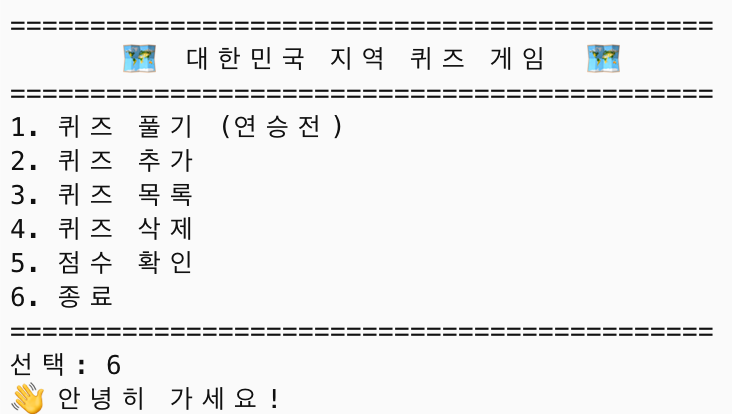
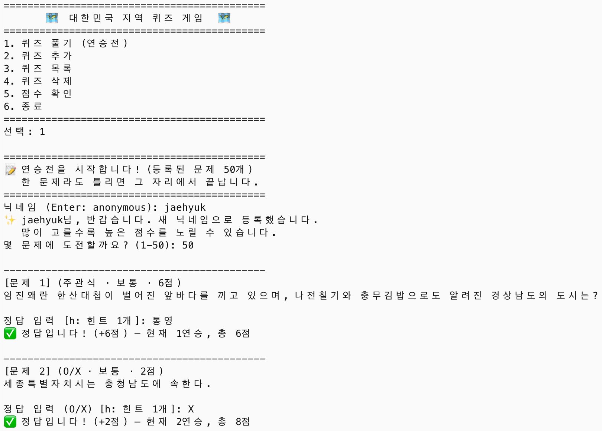
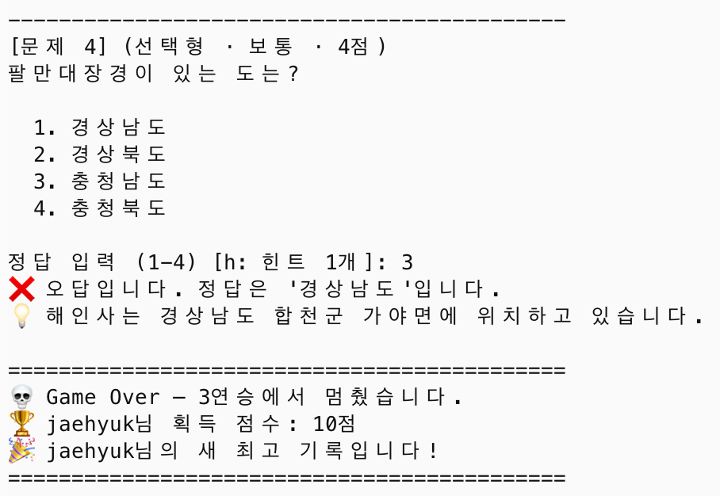
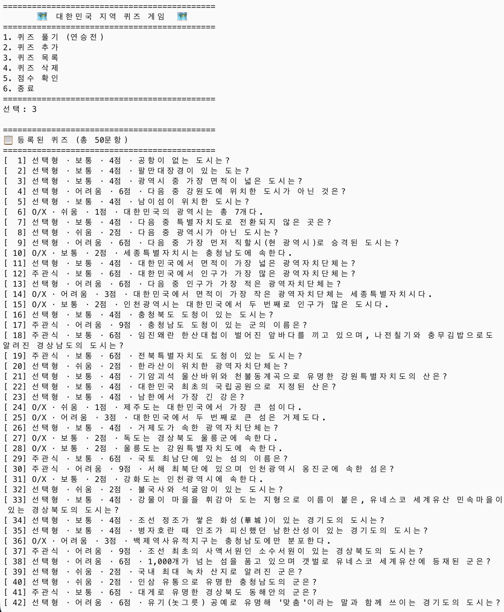
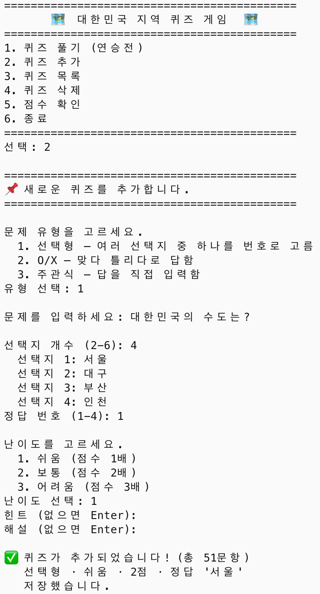
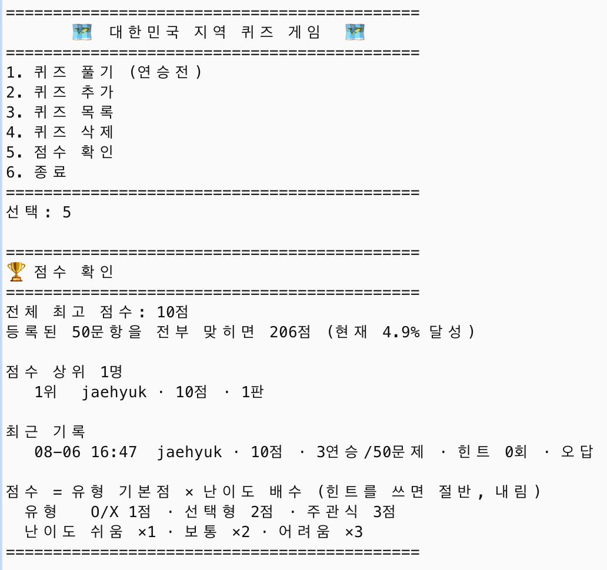
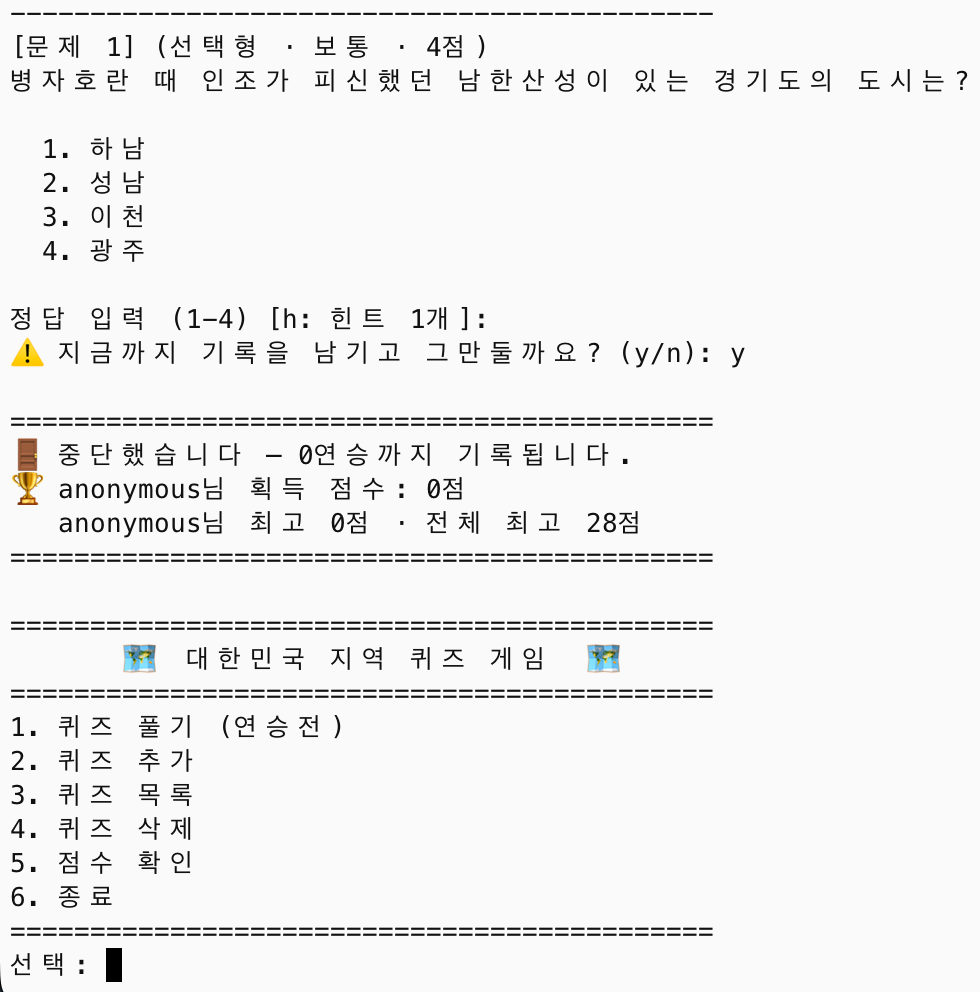
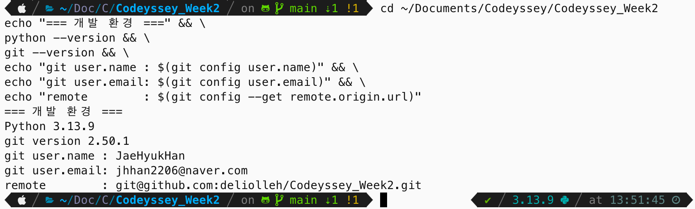
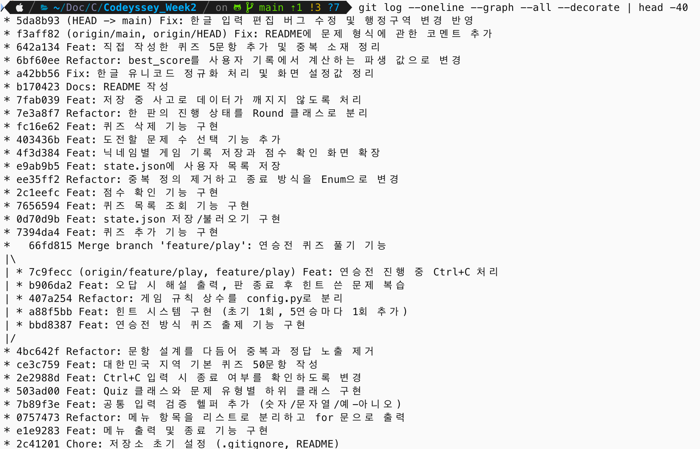

# 🗺️ 대한민국 지역 퀴즈 게임

터미널에서 즐기는 **연승전 방식**의 한국 지역 퀴즈 게임입니다.
한 문제라도 틀리면 그 자리에서 끝나고, 그때까지 모은 점수가 기록으로 남습니다.

```
============================================
       🗺️  대한민국 지역 퀴즈 게임  🗺️
============================================
1. 퀴즈 풀기 (연승전)
2. 퀴즈 추가
3. 퀴즈 목록
4. 퀴즈 삭제
5. 점수 확인
6. 종료
============================================
선택:
```

## 프로젝트 개요

문제를 순서대로 다 푸는 방식이 아니라, **틀리는 순간 끝나는 연승전**입니다.
그래서 "몇 개 맞혔나"가 아니라 "어디까지 버텼나"가 기록이 됩니다.

이 규칙 때문에 다른 기능들이 자연스럽게 따라왔습니다.

- 출제 순서가 고정이면 두 번째 판부터 외워지므로 **매번 섞어서** 출제합니다.
- 한 번 틀리면 끝나기 때문에 구제 수단으로 **힌트**를 뒀습니다. 다만 공짜면 남용되므로 점수를 절반으로 깎고 개수를 제한합니다.
- 오답이 곧 게임 종료라, 그 문제에 대해 배울 마지막 기회인 **해설**을 그 자리에서 보여줍니다.
- 문제마다 난이도와 유형이 다르므로 점수를 **가중치 합계**로 매깁니다. O/X를 열 개 맞히는 것과 주관식 어려움을 세 개 맞히는 것이 같은 값일 수는 없으니까요.

## 퀴즈 주제와 선정 이유

주제는 **대한민국의 지역**입니다. 행정구역, 지리, 명소·유산, 특산물·축제, 교통을 다룹니다.

이 주제를 고른 이유는 국내의 다양한 곳에 대한 정보를 얻는 것과 더불어, **난이도를 넓게 벌릴 수 있어서**입니다.

```
쉬움    한라산이 위치한 광역자치단체는?          → 누구나 아는 상식
보통    충청북도 도청이 있는 도시는?             → 관심이 있으면 아는 수준
어려움  진해 군항제가 열리는 곳은 현재 어느 시?   → 알아도 한 번 더 걸리는 함정
```

마지막 문제가 이 주제의 매력입니다. 군항제는 매우 유명하지만 **진해는 2010년 창원시에 통합돼 더 이상 독립된 시가 아닙니다.** 유명할수록 "진해"라고 답하고 싶어지는, 아는 것과 답이 어긋나는 지점이 지역이라는 주제에 유난히 많습니다.

가중치 점수 체계를 쓰기로 한 이상 난이도가 한쪽에 쏠리면 안 되는데, 지역은 쉬운 문제와 어려운 문제를 고르게 만들 수 있습니다.

## 실행 방법

**Python 3.10 이상**이 필요합니다. 외부 라이브러리는 쓰지 않습니다.

```bash
git clone https://github.com/deliolleh/Codeyssey_Week2.git
cd Codeyssey_Week2
python main.py
```

버전이 낮으면 프로그램이 안내 후 종료합니다.

```
⚠️ 이 프로그램은 Python 3.10 이상이 필요합니다.
   현재 버전: 3.9.6
```

버전 확인:

```bash
python --version
```

## 기능 목록

### 1. 퀴즈 풀기 (연승전)

닉네임과 도전할 문제 수를 정하고 시작합니다. 한 문제라도 틀리면 그 자리에서 끝납니다.

```
닉네임 (Enter: anonymous): jaehyuk
👋 jaehyuk님 (최고 47점 · 12판)
   많이 고를수록 높은 점수를 노릴 수 있습니다.
몇 문제에 도전할까요? (1-50): 10

--------------------------------------------
[문제 1] (선택형 · 보통 · 4점)
조선 정조가 쌓은 화성(華城)이 있는 경기도의 도시는?

  1. 용인
  2. 화성
  3. 수원
  4. 성남

정답 입력 (1-4) [h: 힌트 1개]: 3
✅ 정답입니다! (+4점) — 현재 1연승, 총 4점
```

- **출제 순서 무작위** — 매 판 섞입니다.
- **힌트** — `h`를 누르면 볼 수 있습니다. 시작할 때 1개를 갖고, 5연승마다 1개씩 더 받습니다. 쓰면 그 문제 점수가 절반(내림)이 되므로 1점짜리는 0점이 됩니다. 점수를 포기하고 연승을 잇는 선택입니다.
- **형식 오류는 오답이 아닙니다** — O/X 문제에 `3`을 입력해도 게임이 끝나지 않고 다시 묻습니다.
- **진행 중 Ctrl+C** — 그만둘지 물어보고, 계속하면 문제를 다시 띄웁니다. 그만두면 그때까지의 점수가 기록됩니다.

### 2. 퀴즈 추가

유형을 고르면 그 유형에 필요한 것만 물어봅니다. 추가 즉시 `state.json`에 저장됩니다.

```
문제 유형을 고르세요.
  1. 선택형 — 여러 선택지 중 하나를 번호로 고름
  2. O/X — 맞다 틀리다로 답함
  3. 주관식 — 답을 직접 입력함
```

### 3. 퀴즈 목록

번호 순으로 정렬해 보여줍니다. **정답은 보여주지 않습니다.**

```
[  1] O/X · 쉬움 · 1점 · 대한민국의 광역시는 총 7개다.
[  2] 선택형 · 보통 · 4점 · 다음 중 특별자치도로 전환되지 않은 곳은?
--------------------------------------------
유형   O/X 13 · 선택형 27 · 주관식 10
난이도 쉬움 11 · 보통 23 · 어려움 16
전 문항 정답 시 207점
```

### 4. 퀴즈 삭제

번호로 고른 뒤 문제 내용을 보여주고 확인받습니다. 삭제한 번호는 다시 매기지 않습니다 — 목록에서 본 번호가 다른 문제를 가리키면 엉뚱한 문제를 지우게 되기 때문입니다.

### 5. 점수 확인

```
전체 최고 점수: 47점
등록된 50문항을 전부 맞히면 207점 (현재 22.7% 달성)

닉네임별 최고 기록
   jaehyuk · 47점 · 12판
   minsu · 24점 · 3판

최근 기록
   08-05 14:22  jaehyuk · 47점 · 12연승/50문제 · 힌트 2회 · 오답
```

## 실행 화면

**메뉴와 종료** — 번호를 골라 기능을 실행하고, `6`을 고르면 저장 후 종료합니다.



**퀴즈 풀기 (연승전)** — 닉네임과 도전할 문제 수를 정한 뒤 출제됩니다.



틀리면 그 자리에서 끝납니다. 정답과 해설을 보여준 뒤 결과가 나옵니다.



**퀴즈 목록** — 번호 순으로 정렬해 보여주고, 정답은 노출하지 않습니다.



**퀴즈 추가** — 유형을 고르면 그 유형에 필요한 항목만 물어봅니다.



**점수 확인** — 상위 기록과 최근 기록을 함께 보여줍니다.



**진행 중 Ctrl+C** — 비정상 종료하지 않고 그만둘지 물어봅니다. 그만두면 그때까지의 기록을 남기고 메뉴로 돌아갑니다.



## 점수 계산

```
문제 점수 = 유형 기본점 × 난이도 배수     (힌트를 쓰면 절반, 내림)

유형    O/X 1점 · 선택형 2점 · 주관식 3점
난이도  쉬움 ×1 · 보통 ×2 · 어려움 ×3
```

찍어서 맞힐 확률이 낮은 유형일수록 기본점이 높습니다. O/X는 절반이 맞고, 선택형은 답이 화면에 있고, 주관식은 아무 단서가 없습니다.

최고 점수는 **절대 점수**로 비교합니다. 적은 문제 수를 고르면 그만큼 기록 경신이 어렵습니다.

## 파일 구조

```
Codeyssey_Week2/
├── main.py           진입점. Python 버전 검사, Ctrl+C·EOF 처리
├── game.py           QuizGame — 메뉴, 게임 진행, 퀴즈·사용자 관리
├── session.py        Round — 한 판의 진행 상태 / Ending — 판이 끝난 방식
├── quiz.py           Quiz와 유형별 하위 클래스 (선택형/O/X/주관식)
├── user.py           User — 닉네임과 게임 기록
├── storage.py        Storage — state.json 저장·불러오기, 손상 복구
├── inputs.py         입력 검증 공통 함수 (숫자·문자열·예아니오)
├── config.py         게임 규칙 설정값 (힌트·점수·난이도 등)
├── default_data.py   기본 퀴즈 (직접 작성 5문항 + AI로 만든 확장 문항)
├── state.json        저장 파일
└── docs/screenshots/ 실행 화면
```

### 클래스 관계

```
QuizGame ─── 메뉴와 흐름을 관리
   ├─ Round      한 판의 점수·연승·힌트 상태
   ├─ Quiz       문제 하나 (ChoiceQuiz / OXQuiz / ShortAnswerQuiz)
   ├─ User       사람 하나의 닉네임과 기록
   └─ Storage    파일 읽고 쓰기
```

`Quiz`, `User`, `Storage`는 서로를 모릅니다. 화면 출력과 흐름은 `QuizGame`에만 있어서, 나중에 GUI로 바꾸더라도 나머지는 그대로 쓸 수 있습니다.

## 데이터 파일 설명 (`state.json`)

**위치**: 프로젝트 루트 (`main.py`와 같은 폴더)
**인코딩**: UTF-8 (`ensure_ascii=False`로 한글을 그대로 기록)
**역할**: 퀴즈 데이터와 사용자 기록을 담아, 프로그램을 껐다 켜도 유지되게 합니다.

```json
{
  "_note": "answer는 choices의 순번(1부터). O/X 문제는 O=1, X=2. 주관식은 허용 답안 목록.",
  "quizzes": [
    {
      "id": 1,
      "type": "ox",
      "difficulty": "easy",
      "question": "대한민국의 광역시는 총 7개다.",
      "choices": ["O", "X"],
      "answer": 2,
      "hint": "특별시와 특별자치시는 광역시에 포함되지 않습니다.",
      "explanation": "광역시는 부산·대구·인천·광주·대전·울산 여섯 곳입니다."
    }
  ],
  "best_score": 47,
  "users": [
    {
      "nickname": "jaehyuk",
      "best_score": 47,
      "history": [
        {
          "played_at": "2026-08-05 14:22:10",
          "score": 47,
          "streak": 12,
          "total": 50,
          "hints_used": 2,
          "ending": "wrong"
        }
      ]
    }
  ]
}
```

### 필드 설명

| 키 | 뜻 |
|---|---|
| `_note` | 사람이 읽을 규칙 설명. JSON은 주석을 지원하지 않아 키로 넣었습니다 |
| `quizzes` | 퀴즈 목록. `id` 순으로 정렬해 저장합니다 |
| `best_score` | 전체 최고 점수. **가중치 합계 점수**이지 맞힌 개수가 아닙니다. `users`의 최고 점수 중 최댓값을 저장할 때 계산해 기록합니다 |
| `users` | 사용자 목록. 닉네임 순으로 정렬합니다 |

**퀴즈 항목**

| 키 | 뜻 |
|---|---|
| `id` | 고유 번호. 삭제해도 다시 매기지 않습니다 |
| `type` | `choice`(선택형) / `ox` / `short`(주관식) |
| `difficulty` | `easy` / `normal` / `hard` |
| `choices` | 선택지. 선택형은 2~6개, O/X는 `["O","X"]`, 주관식은 빈 배열 |
| `answer` | **선택형·O/X는 `choices`의 순번(1부터)**, 주관식은 허용 답안 목록 |
| `hint`, `explanation` | 없으면 빈 문자열 |

**사용자 항목**

| 키 | 뜻 |
|---|---|
| `nickname` | 사용자 구분값. 실명일 필요가 없어 '닉네임'이라 부릅니다. 대소문자를 구분하지 않습니다 |
| `history` | 게임 기록. 최근 50판까지 보관하고 넘으면 오래된 것부터 지웁니다 |
| `streak` / `total` | 연속으로 맞힌 수 / 그 판에 도전한 문제 수 |
| `ending` | `cleared`(완주) / `wrong`(오답) / `gave_up`(중단) |

### 왜 `answer`가 유형마다 다른가

선택형과 O/X는 "몇 번째 선택지인가"를 저장합니다. O/X도 `choices`를 `["O","X"]`로 두었기 때문에 **O=1, X=2**가 되어 규칙이 하나로 통일됩니다.

```json
{ "choices": ["제주", "강원", "전북", "충북"], "answer": 4 }   → "충북"
{ "choices": ["O", "X"],                     "answer": 1 }   → "O"
```

주관식은 고를 선택지가 없어 답 문자열을 직접 담습니다. 표기가 여러 가지인 답이 많아 목록으로 둡니다.

```json
{ "choices": [], "answer": ["무안", "무안군"] }
```

채점할 때 **띄어쓰기와 영문 대소문자는 무시**합니다. `" 무 안 군 "`도 정답입니다. 다만 오타는 봐주지 않습니다 — 비슷한 답을 정답으로 인정하면 연승 기록을 믿을 수 없게 되기 때문입니다.

> **문항 구성** — `id` 1~5번은 직접 작성한 문항으로, 과제 요구대로 모두 4지선다이고 정답을 1~4번으로 관리합니다. 6번부터는 AI로 만든 확장 문항이며, 여기에 O/X와 주관식 유형을 더했습니다. `answer`가 `choices`의 순번이라는 규칙은 모든 유형에서 동일합니다.
>
> **기준 시점** — 행정구역은 통합·승격으로 바뀝니다. 2026년 7월 광주광역시와 전라남도가 전남광주통합특별시로 합쳐지면서 광역시는 다섯 곳이 됐고, 관련 문항을 그에 맞춰 정리했습니다.

### 파일이 없거나 손상됐을 때

| 상황 | 처리 |
|---|---|
| 파일 없음 (첫 실행) | 기본 퀴즈 데이터로 시작 |
| JSON 문법 오류, 최상위 구조 이상 | 안내 후 기본 퀴즈로 복구 |
| 문항 하나가 손상 | **그 문항만 건너뛰고** 나머지는 살림 |
| `best_score`가 숫자가 아니거나 음수 | 0으로 되돌림 |
| 사용자 자료 손상 | 그 사용자만 건너뜀 |
| 쓰기 권한 없음 | 안내 후 게임은 계속 |

저장할 때는 임시 파일에 먼저 쓴 뒤 이름을 바꿉니다. 쓰는 도중에 프로그램이 멈춰도 기존 파일이 온전히 남습니다.

## 문항이 늘어나면

1000문항까지 늘렸을 때 무엇이 먼저 막히는지 실제로 재봤습니다.

| 항목 | 50문항 | 1000문항 | 판단 |
|---|---:|---:|---|
| 불러오기 | 0.5 ms | 9.5 ms | 문제없음 |
| 저장 | 0.6 ms | 7.2 ms | 문제없음 |
| 메모리 | 0.1 MB | 2.0 MB | 문제없음 |
| 번호 탐색 (최악) | 0.9 µs | 14.5 µs | 지금은 문제없음 |
| **목록 출력** | **57줄** | **1007줄** | **먼저 막히는 지점** |

성능보다 **화면이라는 물리적 제약**이 먼저 옵니다. 터미널 한 화면이 40~60줄이라 50문항도 이미 넘어가고, 1000문항이면 읽는 것 자체가 불가능합니다.

측정 방법과 개선 방향은 [docs/performance.md](docs/performance.md)에 정리했습니다.

## 개발 환경

- Python 3.13.9 (3.10 이상 필요)
- 표준 라이브러리만 사용 — `json`, `random`, `datetime`, `enum`, `pathlib`, `unicodedata`, `readline`



## 커밋 규칙

### 메시지 형식

```
<Type>: <무엇을 했는지 한 줄>

- 왜 그렇게 했는지
- 함께 판단한 것, 대안을 버린 이유
```

**제목은 무엇을(what), 본문은 왜(why)** 를 적습니다. 코드를 보면 무엇이 바뀌었는지는 알 수 있지만, 왜 그 선택을 했는지는 남겨두지 않으면 사라지기 때문입니다.

### Type

| Type | 쓰는 때 | 실제 예시 |
|---|---|---|
| `Feat` | 기능 추가 | `Feat: 힌트 시스템 구현 (초기 1회, 5연승마다 1회 추가)` |
| `Fix` | 잘못 동작하던 것 수정 | `Fix: 한글 유니코드 정규화 처리 및 화면 설정값 정리` |
| `Refactor` | 동작은 그대로, 구조 개선 | `Refactor: 한 판의 진행 상태를 Round 클래스로 분리` |
| `Docs` | 문서만 변경 | `Docs: README 작성` |
| `Chore` | 설정·빌드 등 부수 작업 | `Chore: 저장소 초기 설정 (.gitignore, README)` |

### 커밋 단위

**하나의 커밋은 하나의 완결된 변경**입니다. 그 시점에 체크아웃해도 프로그램이 동작해야 합니다.

- 기능 단위로 자릅니다 — 메뉴, `Quiz` 클래스, 기본 데이터, 퀴즈 풀기, 저장 등
- 여러 파일이 바뀌어도 **하나의 목적**이면 한 커밋입니다. `Round` 분리는 `game.py`와 `session.py`를 함께 건드리지만 목적이 하나이므로 한 커밋입니다
- 반대로 목적이 다르면 나눕니다. 스크린샷 추가와 데이터 수정은 같은 시점에 작업했어도 따로 커밋했습니다

### 되돌린 변경은 이력에 남기지 않습니다

작업 중 방향이 바뀌면 push 전에 정리합니다.

```bash
git commit --amend          # 직전 커밋에 합치기
git reset --soft HEAD~3     # 여러 커밋을 하나로 묶기
```

넣었다가 뺀 코드가 커밋 두 개로 남으면 "왜 넣었다 뺐지?"만 남고, 그 판단의 맥락은 어차피 이력에 없습니다. 결함이 있는 중간 상태도 남기지 않습니다.

다만 **push한 뒤에는 고치지 않습니다.** 이미 공유된 이력을 바꾸면 다른 사람의 작업과 어긋나기 때문입니다.

## 브랜치와 병합

### 왜 브랜치를 쓰는가

`main`은 **언제 꺼내 써도 동작하는 상태**여야 합니다. 그런데 기능 하나를 만드는 동안에는 중간중간 동작하지 않는 시점이 생깁니다. 연승전을 만들 때도 출제만 되고 채점은 안 되는 상태, 힌트는 나오는데 점수 계산이 안 되는 상태를 거쳤습니다.

그 과정을 `main`에 그대로 쌓으면 "지금 main을 받으면 뭐가 되고 뭐가 안 되는지"를 알 수 없습니다. 브랜치는 그 미완성 구간을 따로 떼어 두는 장치입니다.

이 프로젝트에서는 **퀴즈 풀기 기능**을 `feature/play`에서 작업했습니다.

```bash
git checkout -b feature/play     # main에서 갈라져 나옴
# 출제 → 힌트 → 해설 → Ctrl+C 처리, 커밋 4개
git checkout main
git merge --no-ff feature/play   # 완성된 상태로 main에 합침
```

`main` 입장에서는 **"퀴즈 풀기 기능이 통째로 하나 들어왔다"** 가 됩니다. 그 안에서 힌트를 어떻게 붙였다 고쳤는지는 브랜치에 남아 있고요.

### `--no-ff`를 쓰는 이유

```
--no-ff 병합                     그냥 병합 (fast-forward)
*   Merge branch 'feature/play'   * Feat: Ctrl+C 처리
|\                                * Feat: 해설 출력
| * Feat: Ctrl+C 처리             * Refactor: config 분리
| * Feat: 해설 출력               * Feat: 힌트 시스템
| * Refactor: config 분리         * Feat: 연승전 출제
| * Feat: 힌트 시스템             * Refactor: 문항 설계 정리
| * Feat: 연승전 출제
|/
* Refactor: 문항 설계 정리
```

왼쪽은 **어디서 갈라져 어디서 합쳐졌는지** 보입니다. 오른쪽은 커밋이 일직선으로 붙어 브랜치를 썼다는 사실 자체가 사라집니다. 나중에 "이 기능은 어떤 커밋들로 이루어졌나"를 되짚을 수 없습니다.

병합 커밋 하나를 되돌리면 기능 전체가 빠지는 것도 장점입니다.

### 브랜치를 만들 때 지킨 것

- **브랜치 하나에 목적 하나** — `feature/play`에는 퀴즈 풀기와 관련된 것만 담습니다
- **완성한 뒤에 병합** — 중간 상태로 `main`에 합치지 않습니다
- **병합 후에도 브랜치를 지우지 않음** — 이력 확인용으로 원격에 남겨 뒀습니다

다만 실제로는 한 번 어겼습니다. `config.py` 분리는 게임 규칙 상수를 전역으로 정리하는 작업이라 `feature/play`의 목적을 벗어났는데, 힌트 구현 도중에 필요해져 그 브랜치에서 처리했습니다. 되돌리는 비용이 커서 그대로 뒀고, 병합 커밋 메시지에 그 사실을 적어 두었습니다.

### `clone`과 `pull`

원격 저장소를 다른 곳에 복제해 수정하고, 원래 작업 폴더로 가져오는 흐름도 실습했습니다.

```bash
git clone <저장소 주소> Codeyssey_Week2_clone   # 별도 폴더로 복제
cd Codeyssey_Week2_clone
# README 수정 → commit → push
cd ../Codeyssey_Week2
git pull                                       # 변경사항 가져오기
```

혼자 작업할 때는 굳이 필요 없어 보이지만, **다른 사람이 올린 변경을 받아오는 것**이 협업의 기본 동작입니다. `f3aff82` 커밋이 이 실습으로 만들어진 것입니다.

## 커밋 이력

기능 단위로 커밋했고, 퀴즈 풀기 기능은 `feature/play` 브랜치에서 작업한 뒤 병합했습니다.


